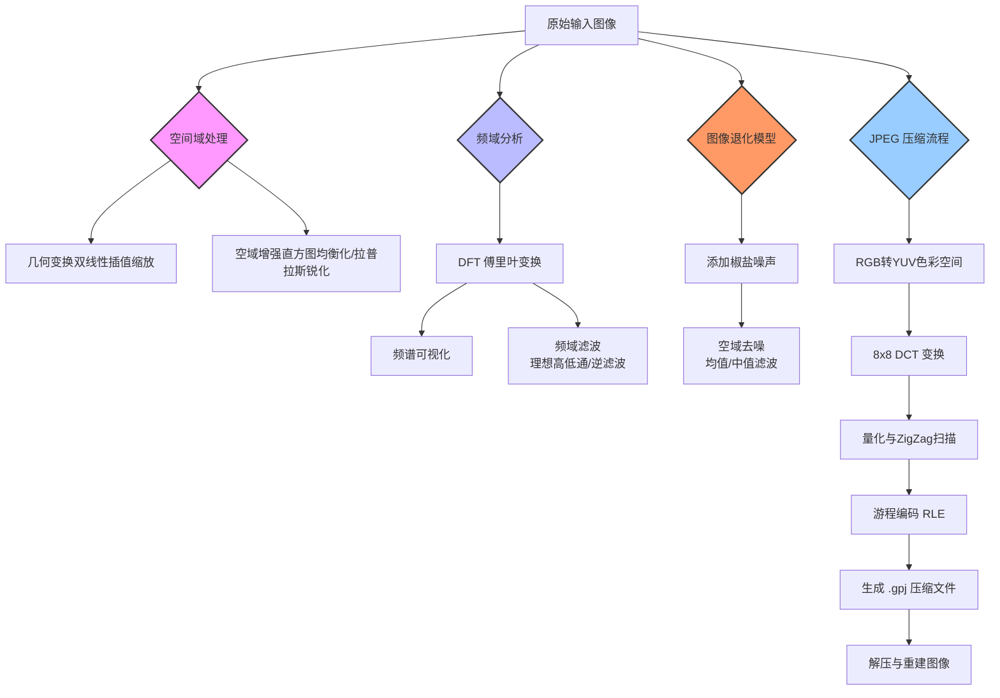

# Image Processing Algorithms Learning Kit
### 数字图像处理算法实践集合

本项目是一个综合性的数字图像处理教学演示仓库，旨在通过Python和OpenCV实现课程中的核心算法概念。项目涵盖了从空域滤波、频域变换到图像压缩的完整流程，适合作为学习数字图像处理（Digital Image Processing）的实践参考。

## 📖 项目简介
该项目通过一系列独立的脚本（`assignment1_x.py`, `assignment2_x.py`），系统性地展示了以下关键技术模块：

1.  **空域图像增强 (Assignment 1)**
    *   直方图统计与均衡化（理论实现与OpenCV接口对比）
    *   双线性插值算法实现图像缩放
    *   拉普拉斯算子进行图像锐化

2.  **频域滤波与分析 (Assignment 2)**
    *   二维离散傅里叶变换（DFT）及其频谱可视化
    *   理想高通/低通滤波器设计与应用
    *   噪声模型（椒盐噪声）及均值/中值滤波去噪
    *   逆滤波（Inverse Filtering）恢复模糊图像

3.  **图像压缩 (Assignment 2 Extension)**
    *   JPEG压缩核心流程实现（非标准，教学用）
    *   包含RGB转YUV、DCT变换、量化、ZigZag扫描及游程编码（RLE）

## ⚙️ 环境依赖与安装

本项目主要基于 Python 生态的图像处理库开发。请确保您的环境中已安装 Python 3.6+。

### 依赖库
项目所需的第三方库如下：
- **OpenCV (`opencv-python`)**: 用于核心的图像读写、DFT变换、滤波及显示操作。
- **NumPy**: 用于高效的矩阵运算和数值计算。
- **Matplotlib**: 用于绘制直方图和频谱图。

### 安装方式
推荐使用 `pip` 进行安装。请在终端中运行以下命令：
```bash
pip install opencv-python numpy matplotlib
```
### Google Colab 注意事项
部分脚本（如 `assignment1_1.py` 和 `assignment1_3.py`）中包含 `from google.colab.patches import cv2_imshow`，这是专门为 Google Colab 环境设计的显示函数。如果在本地 Jupyter Notebook 或 PyCharm 中运行，请将 `cv2_imshow()` 替换为 `cv2.imshow()` 并注意窗口管理机制。

## 🚀 快速开始

本项目由多个独立的 Python 脚本组成，每个脚本对应一个数字图像处理的核心实验。您可以直接运行特定的 `.py` 文件来查看效果。

### 脚本功能速查表
以下是各脚本的主要功能及启动方式：

| 脚本文件名 | 核心功能描述 | 运行命令 |
| :--- | :--- | :--- |
| **`assignment1_1.py`** | **直方图均衡化**<br>实现灰度图像的直方图统计、显示，并通过 OpenCV 接口及手动计算两种方式实现直方图均衡化。 | `python assignment1_1.py` |
| **`assignment1_2.py`** | **图像缩放 (双线性插值)**<br>不依赖 OpenCV 的 `resize` 函数，手动实现双线性插值算法对图像进行缩放。 | `python assignment1_2.py` |
| **`assignment1_3.py`** | **图像锐化**<br>使用高斯模糊与拉普拉斯算子（Laplacian）结合的方式实现图像高频增强与边缘提取。 | `python assignment1_3.py` |
| **`assignment2_1.py`** | **频域分析与滤波**<br>对图像进行二维 DFT 变换，可视化频谱与相位，并实现理想高通/低通滤波器。 | `python assignment2_1.py` |
| **`assignment2_2.py`** | **噪声与复原 (基础)**<br>生成椒盐噪声，对比均值滤波和中值滤波的去噪效果，并实现基于阈值截断的逆滤波。 | `python assignment2_2.py` |
| **`assignment2_2_complex.py`** | **噪声与复原 (复数版)**<br>在频域中对退化函数 $H$ 进行复数形式的逆滤波运算，结果更为精确。 | `python assignment2_2_complex.py` |
| **`assignment2_3.py`** | **JPEG 压缩模拟**<br>实现简化的 JPEG 压缩流程（RGB→YUV, DCT, 量化, ZigZag, RLE），支持压缩与解压。 | `python assignment2_3.py` |

### 示例：运行 JPEG 压缩
如果您想测试图像压缩效果，可以直接运行 `assignment2_3.py`。该程序会读取同目录下的 `1.bmp`，生成压缩文件 `1.gpj`，并解压显示结果图像 `result.bmp`。
```bash
python assignment2_3.py
```

## 🔄 核心工作流程

本项目所涵盖的算法并非孤立存在，它们共同构成了一套完整的数字图像处理学习路径。下图展示了从原始图像输入到最终结果输出的典型处理流程，体现了图像在空间域、频率域以及压缩域的转换关系。

### 图像处理通用管线

### 流程解读
1.  **空间域起点**：图像通常以位图形式输入，首先可以进行几何变换（如 `assignment1_2` 的缩放）或空域增强（如 `assignment1_1` 的直方图均衡化、`assignment1_3` 的锐化）。
2.  **频域转换**：通过 `assignment2_1` 的 DFT 将图像映射至频域，在此空间进行滤波操作（如模糊图像的复原 `assignment2_2` 逆滤波）。
3.  **退化与复原**：模拟真实场景中的噪声干扰（`assignment2_2` 的椒盐噪声），并使用滤波器进行去除，验证算法的鲁棒性。
4.  **压缩与编码**：最后通过 `assignment2_3` 的 JPEG 流程，将处理后的图像进行高效压缩，完成从模拟信号到数字编码的完整闭环。
